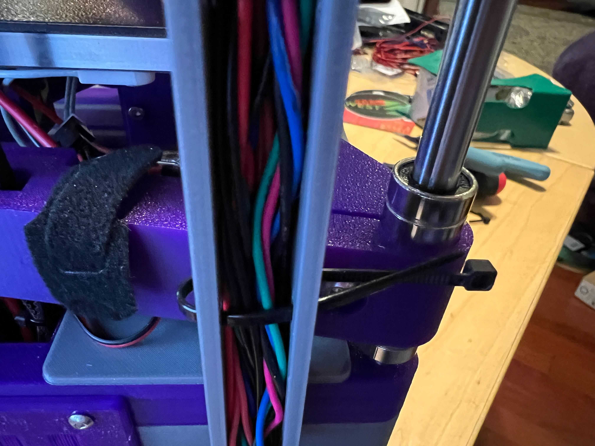

# West3D Rook Build Guide (by thunderkeys)

Build guide for [West3D Rook Kit](https://west3d.com/products/west3ds-rook-3d-printer-configurator-mk1)

Start based on Rook MK1 official build guide located (this guide is based as of 2023-08-10).   [here](https://drive.google.com/file/d/1Nc4iz1Pq0eWxs1gyqM3IEtTrQ-v9zu7r/view).  Differences or addendums to the manual as relates to the base West3D beta kit are below.

Download the West3D specific STLs from [Printables](https://www.printables.com/model/527671-west3d-rook-kit-supplemental-and-recommended-files).

Hardware/fastener differences for first beta kit can be found [here](https://docs.google.com/spreadsheets/d/1AoWmQpuaMPSvE4AcOIU-bLFHbUhuz8i3ynFlrqD2oZg/edit?usp=sharing)

**Page 20:** Use the West3D [Bottom Frame](https://www.printables.com/model/527671-west3d-rook-kit-supplemental-and-recommended-files/files#preview:file-Qj8dy).  Install 14 M3 heatset inserts (4 on the left, 4 on the right, 4 on the rear, 1 on the inside of the frame, and 1 on the top).

Also place heatset inserts into the [Top frame](https://www.printables.com/model/527671-west3d-rook-kit-supplemental-and-recommended-files/files#preview:file-Qj8dr) - 6 on the left, 6 on the right, 6 on the rear, and 8 on the top (for the linear rails).

On the barracks install 4 heatset inserts for the power supply mount on the bottom of the lip.

**Page 21:** Skip - The West3D kit uses the Barracks as a base instead of rubber feet.

**Page 23:** A heatset insert (installed on page 20 above) is used instead of an M3 nut.

**Page 24:** Wire the Z endstop by soldering two wires to the outer pins of the microswitch.  Attach the microswitch to this [printed part](https://www.printables.com/model/527671-west3d-rook-kit-supplemental-and-recommended-files/files#preview:file-uIERz) with 2 M2x10 SHCS self tapper screws, then attach the the part to the endstop installed in step 20 on the inside of the frame with an M3x8 BHCS.

Attach the lid and bottom frame to the barracks using 8 M5x25 BHCS (or SHCS if you prefer).  If you are going to use the included [spool holder mount](https://www.printables.com/model/527671-west3d-rook-kit-supplemental-and-recommended-files/files#preview:file-896Jm) then you can skip installing the front right screw for now.  These screws thread into plastic.

**Page 26:** If using the 3 piece bed, secure the pieces with (1) M3x25 SHCS/BHCS, (2) M3x20 SHCS/BHCS and (3) hex nuts. Secure the LM8UU bearings with a M5x12 SHCS/BHCS at the rear on each end.

**Pages 30, 32:** Skip installing M3 hex nuts as we are using M3 Heatset inserts in their place.

**Page 33, 34:** Use an M3x10 BHCS instead of M3x18 as it is going into a heatset insert.

**Page 39:** Use an M3x10 BHCS instead of M3x16 as it is going into a heatset insert.

**Page 40:** Use (8) M3x12 BHCS instead of M3 nuts/M3x25s as these are going into heatset inserts.

**Page 41:** These can be tightened now.

**Page 42:** Use M3 x 6mm bolts (the manual has a typo in the text).

**Page 48:** You can skip this as we tightened the bolts on Page 41.

**Page 51, 52, 54:** Place an M3 washers between each M3x10 BHCS and the printed part to avoid damage to the plastic.

**Page 70:** For the CHC v6 standard hotend, use M3x10mm BHCS that go through the [Hot End Key Cap](https://www.printables.com/model/527671-west3d-rook-kit-supplemental-and-recommended-files/files#preview:file-tqCBB) instead of M3x16mm screws.

**Page 75:** If using the SKR mini and a Raspberry Pi 4, use [this printed part](https://www.printables.com/model/544118-e3-rpi-holder-for-west3d-rook) for the controller mounts and install 9 heatset inserts.  
  
Install a heatset insert into the top of each of the 4 power supply mount clips (C style for LMS200-10B24).  Mount the clips to the top of the power supply using M4x8mm BHCS.  Refer to [this video in the Rolohaun discord](https://discord.com/channels/946191040682008666/1071189083981881404/1130539585726840894) for details on orientation.  Attach the [Z power holder](https://www.printables.com/model/527671-west3d-rook-kit-supplemental-and-recommended-files/files#preview:file-2vhex) to the bottom of the power supply.  Attach the Raspberry Pi4 and BTT SKR Mini to the top clips as show below.
.  
  
Connect the AC inlet and any DC wires to the power supply leads and SKR mini and install into the case.  Attach with (4) M3x12 BHCS.  This is a tight fight and you may need to bend some of the spade connectors and ferrules.

Wire as shown below (yellow heatshrink wire - hotend fan, blue heatshrink wire - part cooling fans (combine inputs into one wire by soldering or wagos), no heatshrink fan wire - controller fan)

You may need to extend the stepper motor wires to have it reach the SKR mini ports, this can be done with soldering or crimped adapters (I used Microfit to JST-XH).

Barracks fully installed.  Note that I am using a 24v-5v buck convert to power the Raspberry Pi.

**Page 79**: Install the controller fan to the barracks using M3x25 BHCS and M3 hex nuts as shown below.

Install the bed to the bed frame using the included springs and M3x45 BHCS.

Extend bed power and thermistor wiring to electronics bay.  I used wagos for the bed power and a [JST extender](https://www.amazon.com/gp/product/B09BN67SZ8) and secured to the frame using a velcro tie.

For the BMG extruder, make sure your gear orientation has the grub screw towards the top and aligned to the flat of the shaft.

Ensure the 17 tooth gear aligns with the 50 tooth gear. 

Orient the extruder and stepper motor as shown below. Attach extruder to stepper using 3 M3x40 BHCS.

Mount the extruder assembly to the top frame using M3x8 BHCS.

Connect the extruder to the hotend with 4mm OD/2mm ID bowden tube.

If using the spool holder mount, install it now and secure with M5x25 BHCS. To install over the rod, rotate horizontally, place over the rod in the middle then rotate vertically.

Install a cover over the Z motor mount opening with (2) M3x6 BHCS.

Install the cable raceway with (2) M3x8 BHCS.  Route wires within channel and secure with zip ties.

My [printer.cfg](printer.cfg).  Make sure you [tune for sensorless xy homing](https://docs.vorondesign.com/community/howto/clee/sensorless_xy_homing.html)

